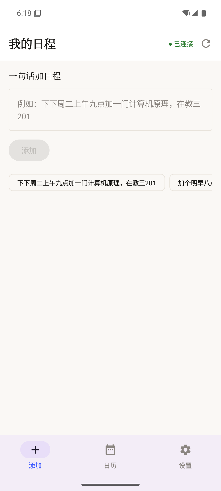
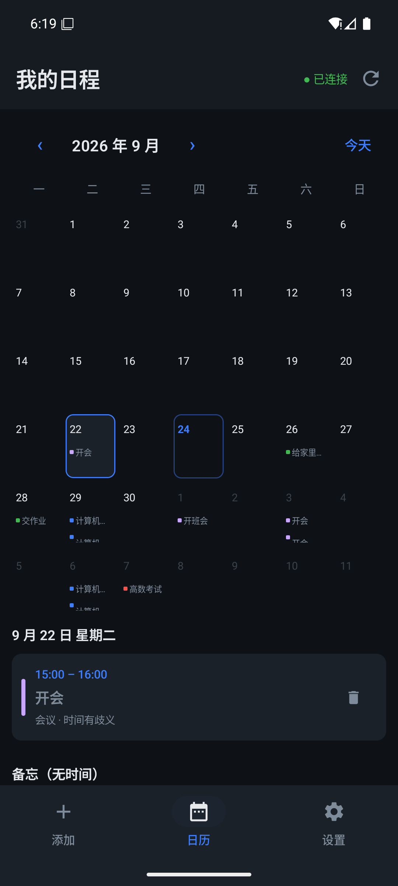
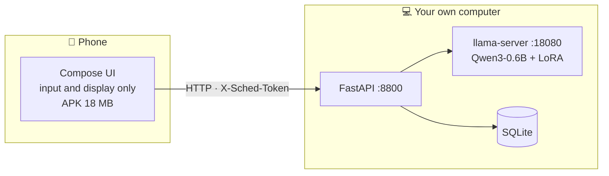

# AI Schedule Assistant · Android client

**Add a calendar event in one sentence. Inference runs on your own computer; the phone only handles input and display.**

[中文](README.md) · [Screens](#screens) · [Build](#build) · [Connect to the backend](#connect-to-the-backend)

| Paper | Night Ops |
|---|---|
|  |  |

---

## What this is

The Android client for
[Local Schedule Assistant](https://github.com/Liu-XY2003/qwen-schedule-agent).
The backend runs on your own computer (FastAPI + llama.cpp + Qwen3-0.6B + LoRA) and the
phone talks to it over HTTP.



**Why not run the model on the phone?** On-device inference would take an estimated 2–4 s
versus **850 ms** talking to your own computer; it would also mean shipping a 378 MB model in
the APK plus an NDK cross-compile. The phone and the computer are already on the same Tailscale
network, so connecting directly is by far the simplest option.

**All date resolution happens on the computer.** The phone does no date arithmetic at all, so the
phone and the web UI can never disagree about an absolute time.

> A client alone is not enough — start the backend first:
> [qwen-schedule-agent](https://github.com/Liu-XY2003/qwen-schedule-agent).

---

## Screens

Three tabs:

| Tab | Contents |
|---|---|
| **Add** | Text field, tappable examples, result card |
| **Calendar** | Month grid (colour-coded by type), tap a day for details, swipe to delete, memos below |
| **Settings** | Appearance, access token, server address, connection status, clear all |

### The result card shows the whole pipeline

```
● Added                                           1043ms
  ▎ Computer Architecture
    class · 10-06 09:00
  ▎ Alarm
    alarm · 09-26 08:00 · ambiguous time
    · user only said "08:00" without am/pm; resolved by routine rules

  Model output
  {"status":"ok","commands":[...]}
```

The model output, the contract validation result and every step's timing are all in there.
**This is a debugging surface, not just a result surface** — a small model occasionally produces
an ambiguous parse, and seeing exactly what it emitted beats a bare "failed".

### Two themes

- **Paper** — warm off-white `#FAF8F5`, serif headings, soft tinted event chips. Comfortable for
  reading a timetable in daylight.
- **Night Ops** — near-black `#0E1116`, sans-serif, 3px colour bars. High information density.

Settings has three **live preview** cards (each drawing its own background, border and module
colours). Tap to switch; "Follow system" is available. **An explicit choice overrides the system
light/dark setting.**

The colours are not hand-written: `ui/theme/Tokens.kt` is generated by the **backend repo's**
`theme/gen_theme.py` from `theme/tokens.json`. The web UI and this app share one set of tokens,
so the two can never drift apart.

> To change colours, edit the backend's `theme/tokens.json` and re-run the generator.
> **Do not edit `Tokens.kt` (it gets overwritten) or `Palette.kt` (it is lookup logic).**

---

## Requirements

| | |
|---|---|
| JDK | **17** (AGP 9.x requires it; builds fail if `JAVA_HOME` points at something older) |
| Android SDK | platform 36+ / build-tools 36+ |
| Gradle | 9.5 (wrapper included — nothing to install) |
| minSdk / targetSdk | 26 / 37 |

---

## Build

```bash
# Linux / macOS
JAVA_HOME=/path/to/jdk-17 ./gradlew assembleDebug
```

```powershell
# Windows
$env:JAVA_HOME = 'C:\Program Files\Java\jdk-17'
.\gradlew.bat assembleDebug
```

Output: `app/build/outputs/apk/debug/app-debug.apk` (about 18 MB)

### Install on a phone

Enable "Developer options → USB debugging", plug in USB:

```bash
adb install -r app/build/outputs/apk/debug/app-debug.apk
```

Or just copy the APK to the phone and tap it.

---

## Connect to the backend

The app does not include a server. **Start the computer side first** (see the backend repo's
quick start).

Then open **Settings** in the app and enter **your own computer's** address:

| Where the phone is | What to enter |
|---|---|
| Same Tailscale network | `http://100.x.y.z:8800` ← **recommended**: end-to-end encrypted, network-agnostic |
| Same WiFi / hotspot | `http://192.168.x.y:8800` |
| USB port forwarding | `http://127.0.0.1:8800` (run `adb reverse tcp:8800 tcp:8800` first) |

Tap "Save and reconnect". **● Connected** in the top bar means it worked.

### If the backend has an access token

When the backend is started with `SCHED_TOKEN=...`, every request under `/api` requires that
token. Enter the same value under "Access token" in Settings. Without it you will see
**▲ Token required**.

> **Do not expose port 8800 to the public internet.** The backend has no authentication by
> default, so public reachability means anyone can read your calendar — or wipe it in one request.
> Use a private network like Tailscale, or set a token.

---

## Code layout

```
app/src/main/java/com/liuxinyang/ai_scheduleassistant/
├─ MainActivity.kt            Scaffold, three tabs, theme wiring
├─ data/
│  ├─ Models.kt               Data models + module display names / colour indices
│  ├─ Api.kt                  OkHttp client (health / chat / events / delete / reset)
│  └─ Prefs.kt                Server URL · theme · token (SharedPreferences)
└─ ui/
   ├─ ScheduleViewModel.kt    State management (coroutines + mutableStateOf)
   ├─ HomeScreen.kt           Input + result card
   ├─ CalendarScreen.kt       Month grid + day details + memos
   ├─ SettingsScreen.kt       Appearance / token / address / connection status
   ├─ Palette.kt              Colour lookup (@Composable, follows the active theme)
   └─ theme/
      ├─ Tokens.kt            ★ generated by the backend repo, do not edit
      ├─ Theme.kt             token → Material3 mapping + theme selection
      └─ Type.kt / Color.kt   Typography and scaffold colours
```

**Very few dependencies**: only OkHttp and `lifecycle-viewmodel-compose` beyond the defaults.
JSON uses Android's built-in `org.json`, which avoids fights with very new AGP/Compose versions.

---

## Debugging notes

All of these were hit and fixed for real; recording them so they don't come back.

| # | Symptom | Root cause | Fix |
|---|---|---|---|
| 1 | UI showed `错误: null`, `📍 null · null` | `JSONObject.optString(key, fallback)` returns the **string `"null"`** for JSON `null` (because `JSONObject.NULL.toString()` *is* `"null"`), not the fallback | Added a `str()` helper that checks `isNull()` first |
| 2 | "Clear all events" was hidden behind the nav bar | `enableEdgeToEdge` + Scaffold's `bottomBar` covers the end of scrollable content | Added an 88dp bottom spacer to all three screens |
| 3 | Backend had 10 events, the app showed 1 | It only refreshed on launch, not on tab switch | Auto-refresh when switching to Calendar/Settings, plus a refresh button in the top bar |
| 4 | A **pale purple pill** appeared in the nav bar, clashing with the theme | Material3's `NavigationBar` selected indicator uses `secondaryContainer`; overriding only `background`/`surface` is not enough | `toColorScheme()` now assigns every M3 slot explicitly |
| 5 | Compile error: `baseUrl` setter clashed with `fun setBaseUrl()` | On the JVM a property setter *is* `setBaseUrl` | Renamed to `applyBaseUrl` |
| 6 | `Property delegate must have a 'getValue'` | Missing `import androidx.compose.runtime.getValue` | Added the import |
| 7 | Syntax error reported dozens of lines away; "Unclosed comment" | **Kotlin block comments nest.** A KDoc line containing `/api/*` opens a nested comment, so the closing `*/` only closes the inner one and the comment swallows the following code | Avoid that character sequence in comments |

### Emulator setup

```bash
# Create with avdmanager (NOT `android emulator create`, which ignores the image you specify)
avdmanager create avd -n sched -k "system-images;android-36;google_apis;x86_64" -d "pixel_6"

emulator -avd sched &
adb wait-for-device
```

> **Gotcha**: the newer Android CLI's `android emulator create` ignores your chosen image and
> downloads a different 1.8 GB playstore build instead (slowly). Use `avdmanager`.

> **Gotcha**: `adb exec-out screencap -p > file.png` **corrupts the binary stream** under
> PowerShell. Use `adb shell screencap -p /sdcard/x.png` and then `adb pull`.

---

## Known limitations

| Limitation | Notes |
|---|---|
| **Add only** | The backend's `action` currently only supports `add`. Edit/delete is manual, in the calendar |
| Computer must be on | Inherent to the architecture |
| Cleartext HTTP | Tailscale is already end-to-end encrypted, so `usesCleartextTraffic` is enabled |
| Result card is not persisted | Survives tab switches (`rememberSaveable`) but is lost if the process is killed |
| No reminder notifications | Events live on the computer; the phone will not buzz |
| No multi-day events in the grid | Events are filed under their start date |

---

## License

[MIT](LICENSE)

OkHttp and Jetpack Compose are Apache-2.0.
