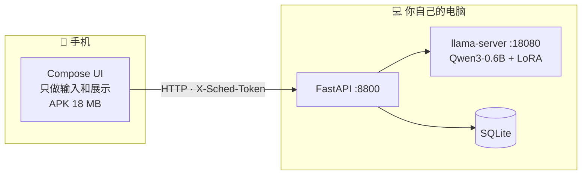

# AI 日程助手 · 安卓客户端

[](https://github.com/Liu-XY2003/AI-ScheduleAssistant/actions/workflows/android.yml)
[](https://github.com/Liu-XY2003/AI-ScheduleAssistant/releases)
[](LICENSE)

**一句话加日程。推理跑在你自己的电脑上，手机只做输入和展示。**

[English](README.en.md) · [界面](#界面) · [构建](#构建) · [连接后端](#连接后端)

| 纸感 (Paper) | 夜航 (Night Ops) |
|---|---|
|  |  |

---

## 这个 App 是什么

[本地日程助手](https://github.com/Liu-XY2003/qwen-schedule-agent) 的安卓客户端。
后端跑在你自己的电脑上（FastAPI + llama.cpp + Qwen3-0.6B + LoRA），
手机通过 HTTP 连过去。



**为什么不在手机端跑模型？** 端侧推理预计 2–4 秒，而连自己电脑是 **850 ms**；
而且端侧要把 378 MB 模型塞进 APK、还得 NDK 交叉编译。手机和电脑本来就在同一个
Tailscale 网络里，直接连最省事。

**所有时间解析都在电脑端完成** —— 手机不做任何日期推导，所以手机和网页版看到的
绝对时间必然一致。

> 只有客户端是不够的，需要先跑起后端：见
> [qwen-schedule-agent](https://github.com/Liu-XY2003/qwen-schedule-agent)。

---

## 界面

三个 Tab：

| Tab | 内容 |
|---|---|
| **添加** | 输入框 + 常用示例（点一下填入）+ 结果卡片 |
| **日历** | 月视图（按类型着色）、点日期看当天详情、左滑删除、下方备忘区 |
| **设置** | 外观、访问令牌、服务地址、连接状态、清空日程 |

### 结果卡片会把整条链路摊开

```
● 已添加                                          1043ms
  ▎ 计算机原理
    课程 · 10-06 09:00
  ▎ 闹钟
    闹钟 · 09-26 08:00 · 时间有歧义
    · 用户只说「08:00」未说上午下午, 按作息规则消歧

  模型输出
  {"status":"ok","commands":[...]}
```

模型输出、契约校验结果、每一步耗时都在里面。**这是调试界面，不只是结果界面** ——
小模型偶尔会给出有歧义的解析，能看到它到底输出了什么，比只显示"失败了"有用得多。

### 两套主题

- **纸感**：暖米白 `#FAF8F5` + 衬线标题 + 淡彩事件块，白天看课表舒服
- **夜航**：近黑 `#0E1116` + 无衬线 + 左侧 3px 色条，信息密度高

设置页有三块**实时预览**卡片（直接画出该主题的底色 / 边框 / 模块色），点一下即切换，
可选「跟随系统」。**显式选择会覆盖系统的深浅色设置。**

配色不是手写的：`ui/theme/Tokens.kt` 由**后端仓库**的 `theme/gen_theme.py` 从
`theme/tokens.json` 生成。网页版和这个 App 共用同一份 token，所以两边颜色永远一致。

> 要改配色请改后端的 `theme/tokens.json` 然后重跑生成器，
> **不要直接编辑 `Tokens.kt` 或 `Palette.kt`**（前者会被覆盖，后者是取值逻辑）。

---

## 环境要求

| 项 | 值 |
|---|---|
| JDK | **17**（AGP 9.x 要求。若你的 `JAVA_HOME` 指向更老的版本，构建时会报错） |
| Android SDK | platform 36+ / build-tools 36+ |
| Gradle | 9.5（wrapper 已配好，不用自己装） |
| minSdk / targetSdk | 26 / 37 |

---

## 构建

```bash
# Linux / macOS
JAVA_HOME=/path/to/jdk-17 ./gradlew assembleDebug
```

```powershell
# Windows
$env:JAVA_HOME = 'C:\Program Files\Java\jdk-17'
.\gradlew.bat assembleDebug
```

产物：`app/build/outputs/apk/debug/app-debug.apk`（约 18 MB）

### 安装到手机

手机打开「开发者选项 → USB 调试」，插上 USB：

```bash
adb install -r app/build/outputs/apk/debug/app-debug.apk
```

或者直接把 APK 传到手机上点击安装。

---

## 连接后端

App 本身不带服务，**先让电脑端跑起来**（见后端仓库的快速开始）。

然后 App 里进「设置」，填**你自己电脑**的地址：

| 手机在哪 | 填什么 |
|---|---|
| 同一个 Tailscale 网络 | `http://100.x.y.z:8800` ← **推荐**，端到端加密且不挑网络 |
| 同一个 WiFi / 热点 | `http://192.168.x.y:8800` |
| USB 端口转发 | `http://127.0.0.1:8800`（先跑 `adb reverse tcp:8800 tcp:8800`） |

点「保存并重连」，标题栏右上角出现 **● 已连接** 就通了。

### 如果后端设了访问令牌

后端用 `SCHED_TOKEN=...` 启动时，所有 `/api/*` 都要求令牌。
在设置页的「访问令牌」里填同一个值即可。没填会看到 **▲ 需要访问令牌**。

> **不要把 8800 端口直接暴露到公网。** 后端默认没有鉴权，公网可达等于任何人
> 都能读你的日程、甚至一键清空。要么用 Tailscale 这类私有网络，要么设令牌。

---

## 代码结构

```
app/src/main/java/com/liuxinyang/ai_scheduleassistant/
├─ MainActivity.kt            Scaffold + 三个 Tab + 主题装配
├─ data/
│  ├─ Models.kt               数据模型 + 日程类型中文名 / 配色下标
│  ├─ Api.kt                  OkHttp 客户端（health / chat / events / delete / reset）
│  └─ Prefs.kt                服务地址 · 主题 · 令牌（SharedPreferences）
└─ ui/
   ├─ ScheduleViewModel.kt    状态管理（协程 + mutableStateOf）
   ├─ HomeScreen.kt           输入 + 结果卡片
   ├─ CalendarScreen.kt       月历 + 当天详情 + 备忘
   ├─ SettingsScreen.kt       外观 / 令牌 / 地址 / 连接状态
   ├─ Palette.kt              配色取值（@Composable，跟随当前主题）
   └─ theme/
      ├─ Tokens.kt            ★ 由后端仓库生成，勿手改
      ├─ Theme.kt             token → Material3 映射 + 主题选择
      └─ Type.kt / Color.kt   字体与脚手架自带色
```

**依赖很少**：只额外加了 OkHttp 和 `lifecycle-viewmodel-compose`。
JSON 用 Android 内置的 `org.json`，避免和很新的 AGP/Compose 版本打架。

---

## 调试记录

都是实际踩到并修掉的，记下来免得重蹈：

| # | 现象 | 根因 | 修法 |
|---|---|---|---|
| 1 | 界面上出现 `错误: null`、`📍 null · null` | `JSONObject.optString(key, fallback)` 遇到 JSON 的 `null` 会返回**字符串 `"null"`**（因为 `JSONObject.NULL.toString()` 就是 `"null"`），而不是 fallback | 加 `str()` 辅助函数，先 `isNull()` 判断 |
| 2 | 设置页底部「清空全部日程」被导航栏遮住 | `enableEdgeToEdge` + Scaffold 的 `bottomBar` 会盖住 scroll 内容末尾 | 三个页面底部各加 88dp 留白 |
| 3 | 后端有 10 条日程，App 只显示 1 条 | 只在启动时刷新，切 Tab 不刷新 | 切到日历 / 设置页时自动刷新 + 顶栏加刷新按钮 |
| 4 | 底栏出现一块和主题完全不搭的**淡紫色药丸** | Material3 的 `NavigationBar` 选中指示器用 `secondaryContainer`，只覆盖 `background`/`surface` 是不够的 | `toColorScheme()` 把 M3 槽位全部显式赋值 |
| 5 | `baseUrl` 属性 setter 与 `fun setBaseUrl()` 签名冲突，编译失败 | JVM 上属性 setter 就叫 `setBaseUrl` | 重命名为 `applyBaseUrl` |
| 6 | `Property delegate must have a 'getValue'` | 忘了 `import androidx.compose.runtime.getValue` | 补 import |

### 模拟器调试

```bash
# 用 avdmanager 建（不要用 `android emulator create`，它不接受指定镜像）
avdmanager create avd -n sched -k "system-images;android-36;google_apis;x86_64" -d "pixel_6"

emulator -avd sched &
adb wait-for-device
```

> **坑**：新版 Android CLI 的 `android emulator create` 会忽略你指定的镜像，
> 转而去下载另一个 1.8 GB 的 playstore 版本（而且很慢）。用 `avdmanager`。

> **坑**：`adb exec-out screencap -p > file.png` 在 PowerShell 里会**损坏二进制流**。
> 正确做法是 `adb shell screencap -p /sdcard/x.png` 然后 `adb pull`。

---

## 已知限制

| 限制 | 说明 |
|---|---|
| 只能**添加** | 后端的 `action` 目前只有 `add`。改 / 删只能在日历里手点 |
| 电脑必须开机 | 路线 B 的固有前提 |
| 明文 HTTP | Tailscale 本身端到端加密，所以放开了 `usesCleartextTraffic` |
| 结果卡片不持久 | 切 Tab 保留（`rememberSaveable`），进程被杀后会丢 |
| 无提醒推送 | 日程存在电脑端，手机不会主动提醒 |
| 日历不显示跨天事件 | 只按开始日期归到某一天 |

---

## 许可

[MIT](LICENSE)

OkHttp 与 Jetpack Compose 均为 Apache-2.0。
